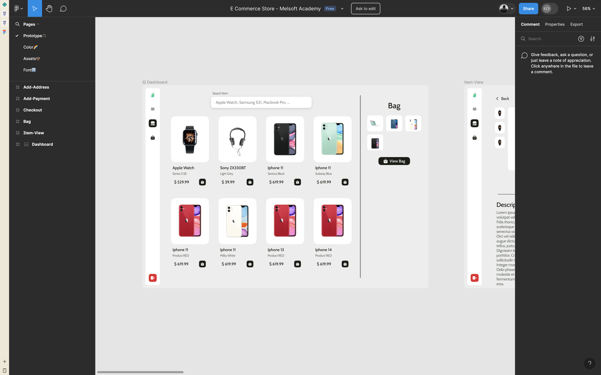
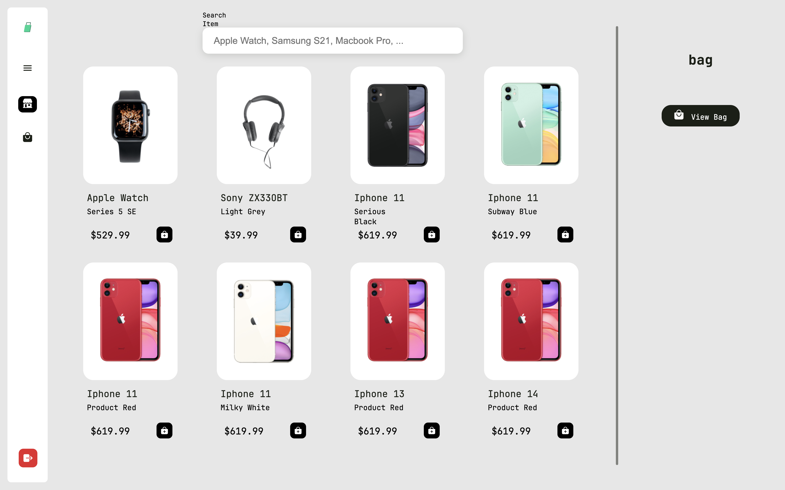

#### Applesa

###### Date Started: 04/23/2024

###### Last Updated: 06/04/2024

###### Deployment: Netlify

---

###### Tech Stack: ReactJS HTML5 & CSS Figma

---

##### Welcome to Applesa! If you're here, you're checking out how to make your own Apple store and you can rest assured that you come to the right place. Feel free to explore around, check my partner's github as well and remember, the code is yours to adapt and use however you like.Enjoy!

---

##### Note: The first image is the one of the figma file and the second image is the project done

---

---

---

###### Features:

##### Payment Page, Address Page, Checkout Page

###### Process:

##### The application was built using ReactJS, HTML5, and CSS. The design was from a Figma file [image one] and then implemented in code. The goal was to replicate the Figma design to the best of our capabilities and i would dare say myself that we did a pretty good job, the only problem was we never considered the best pratice for a responsive desigin

###### Learnings:

##### Building this application provided valuable experience in implementing a payment page, managing user addresses, and creating a checkout process. It also reinforced skills in using ReactJS, HTML5, CSS, and Figma. The project highlighted the importance of user experience design in e-commerce applications. Area's for improvement is making the application responsive for smaller screens and patching up the code base
